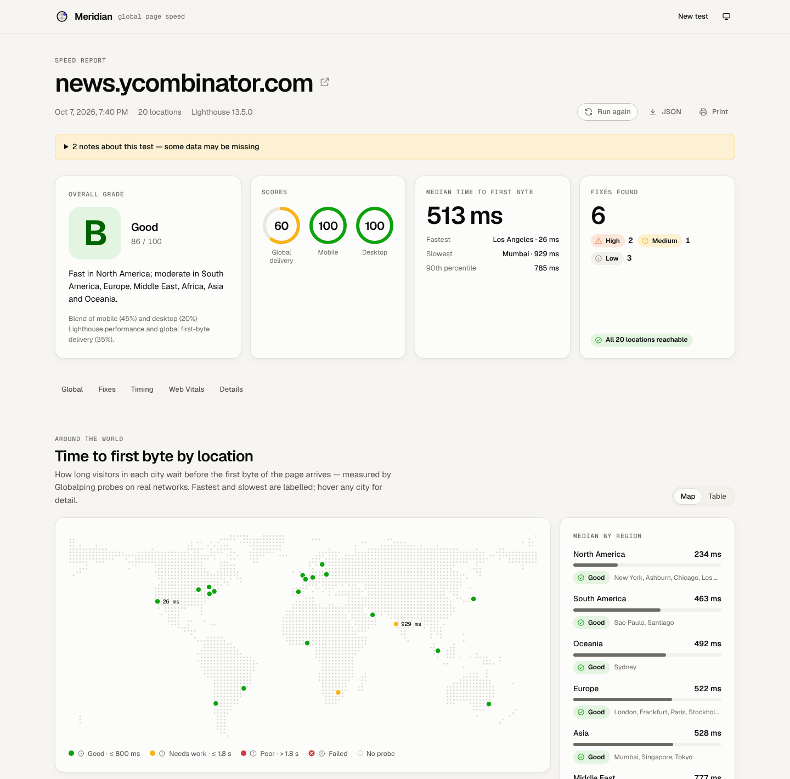
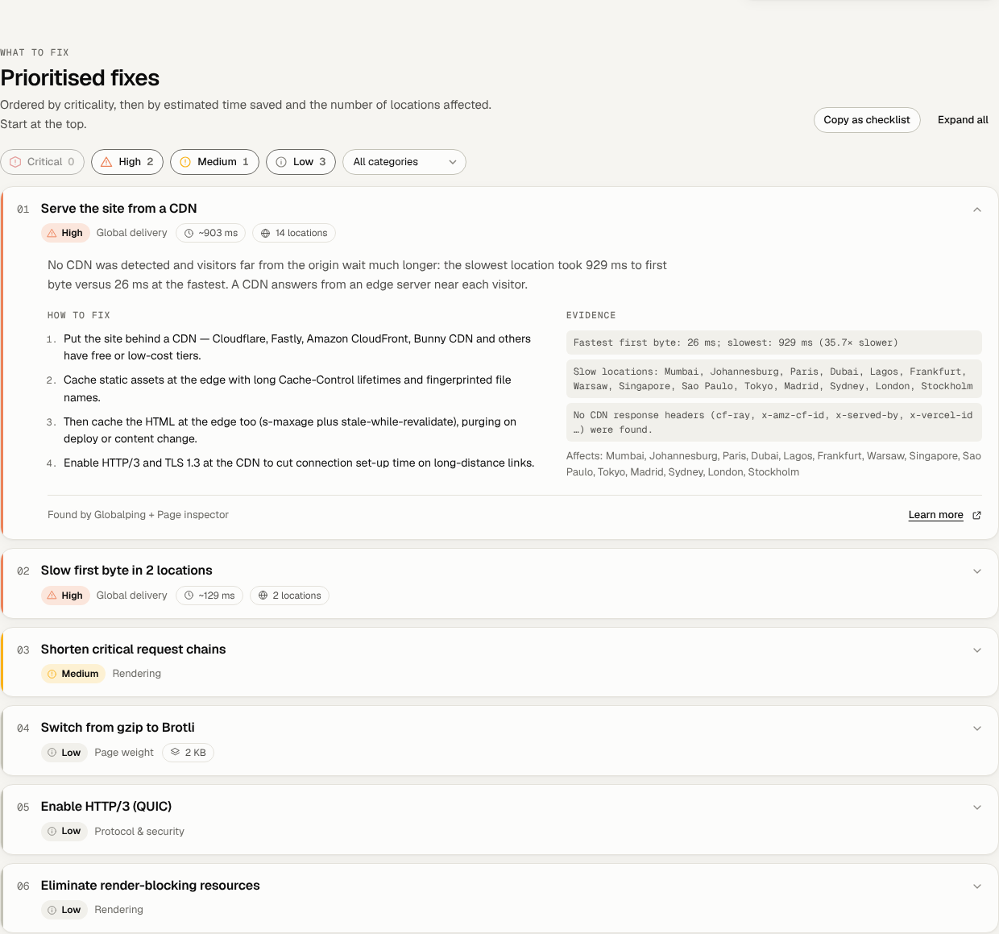
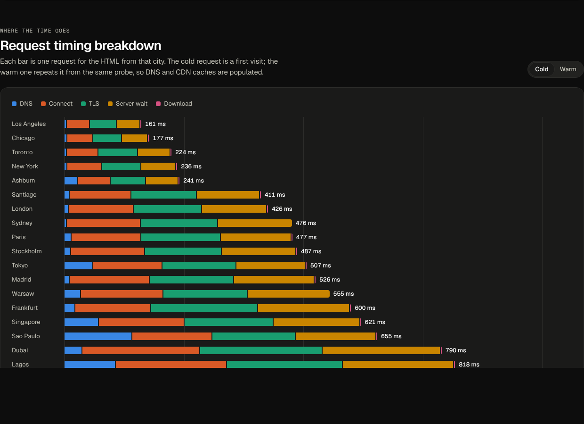

<div align="center">

# Meridian

**How fast is your site, everywhere?**

Load any web page from London, Frankfurt, Sydney, São Paulo, Tokyo and 30+ other cities,
then get a ranked list of exactly what to fix — most critical first.

[](https://github.com/MarciusWong/meridian/actions/workflows/ci.yml)
[](LICENSE)




</div>

---

## What it does

Most speed tests run from one place. Your visitors don't. Meridian measures your page **from every
continent at once**, audits it with Lighthouse, and turns everything it finds into a **prioritised
fix list** with the evidence behind each item and concrete steps to fix it.

- 🌍 **Global first-byte map** — real HTTP requests from probes in up to 30 cities, first visit and repeat visit
- ⏱️ **Where the time goes** — DNS, connect, TLS, server wait and download for every city
- 🧪 **Full Lighthouse audit** — mobile and desktop, Core Web Vitals, plus real-user data when a free Google key is set
- 🔎 **Delivery checks** — redirects, compression, HTTP/2 and HTTP/3, caching headers, CDN detection, TLS certificate, HTML structure
- 🧭 **Prioritised fixes** — ranked by severity, then by time saved, bytes saved and locations affected; duplicates across tools are merged
- 📋 **Share it** — every report has a link, and exports to JSON, print/PDF or a Markdown checklist for your issue tracker
- 🌓 Light and dark themes, works on phones, keyboard and screen-reader friendly

<table>
<tr>
<td width="55%"></td>
<td width="45%"></td>
</tr>
</table>

## Built on free and open tools

| Source                                                                                                                                            | What Meridian uses it for                                               | Needs a key?                              |
| ------------------------------------------------------------------------------------------------------------------------------------------------- | ----------------------------------------------------------------------- | ----------------------------------------- |
| [Globalping](https://globalping.io) — open-source network of 5,000+ probes                                                                        | HTTP timings, CDN cache status, TLS certificate and ping from each city | No (a free token raises the hourly limit) |
| [Lighthouse](https://github.com/GoogleChrome/lighthouse) — open source                                                                            | Lab audit in headless Chrome, mobile and desktop                        | No — runs on your server                  |
| [PageSpeed Insights API](https://developers.google.com/speed/docs/insights/v5/about) + [Chrome UX Report](https://developer.chrome.com/docs/crux) | Lighthouse run by Google, plus 28 days of real-user Core Web Vitals     | Free key recommended                      |
| Built-in page inspector                                                                                                                           | Redirects, compression, protocols, headers, CDN, HTML structure         | No                                        |
| [WebPageTest](https://www.webpagetest.org) (optional)                                                                                             | Real-browser page loads from WebPageTest locations                      | Yes                                       |

## Quick start

### Docker (recommended)

```bash
git clone https://github.com/MarciusWong/meridian.git
cd meridian
docker compose up -d
```

Open **http://localhost:8787**. The image includes Chromium, so Lighthouse works out of the box.
Reports are kept in the `meridian-data` volume.

### Node.js

Requires **Node.js 20.19+**, and Chrome or Chromium for local Lighthouse runs.

```bash
git clone https://github.com/MarciusWong/meridian.git
cd meridian
npm install
npm run build
npm start            # http://localhost:8787
```

For development with hot reload: `npm run dev` (UI on http://localhost:5173, API on :8787).

### Recommended: add free API keys

Meridian works with no keys at all, but two free keys make it better:

```bash
cp .env.example .env
```

- **`PSI_API_KEY`** — [get one here](https://developers.google.com/speed/docs/insights/v5/get-started). Without it,
  Google usually rate-limits anonymous requests, so Lighthouse runs locally and real-user data is missing.
- **`GLOBALPING_TOKEN`** — [create one here](https://dash.globalping.io). Anonymous use is limited to 250 probe
  measurements per hour per IP address; a default 20-city test uses 60.

`npm start`, `npm run dev` and `docker compose` all read `.env` automatically.

## Configuration

All settings are optional environment variables. See [`.env.example`](.env.example) for the annotated list.

| Variable                | Default        | Description                                                                                 |
| ----------------------- | -------------- | ------------------------------------------------------------------------------------------- |
| `PORT`                  | `8787`         | Port for the UI and API                                                                     |
| `HOST`                  | `0.0.0.0`      | Interface to listen on                                                                      |
| `PSI_API_KEY`           | —              | Google PageSpeed Insights key (adds real-user data)                                         |
| `GLOBALPING_TOKEN`      | —              | Globalping token (higher probe limits)                                                      |
| `WPT_API_KEY`           | —              | Enables WebPageTest real-browser runs                                                       |
| `LIGHTHOUSE_MODE`       | `auto`         | `auto` (PageSpeed Insights, then local), `psi`, `local` or `off`                            |
| `CHROME_PATH`           | auto-detected  | Chrome/Chromium binary for local Lighthouse                                                 |
| `RATE_LIMIT_PER_HOUR`   | `10`           | Tests each client IP may start per hour (`0` = unlimited)                                   |
| `MAX_CONCURRENT_JOBS`   | `3`            | Tests running at the same time                                                              |
| `PUBLIC_HISTORY`        | `false`        | Show every visitor a shared list of recent reports                                          |
| `REPORT_RETENTION_DAYS` | `30`           | Delete reports older than this (`0` = keep forever)                                         |
| `DATA_DIR`              | `data/reports` | Where reports are stored as JSON                                                            |
| `TRUST_PROXY`           | `loopback`     | Set behind a reverse proxy (`true`, a hop count, or an address) so rate limits see real IPs |
| `ALLOW_PRIVATE_TARGETS` | `false`        | Allow testing private/local addresses (trusted networks only)                               |

## Hosting a public instance

Meridian runs anywhere that runs a Docker image: a VPS, Fly.io, Render, Railway, Google Cloud Run and so on.

- **Resources:** at least 1 vCPU and 1–2 GB RAM. Local Lighthouse runs one audit at a time and uses most of a CPU while it runs.
- **Shared memory:** give the container more than Docker's 64 MB default (`--shm-size=1g`, already set in `docker-compose.yml`).
- **Persistence:** mount a volume at `/data` to keep reports across deploys.
- **Reverse proxy and HTTPS:** terminate TLS in your proxy and set `TRUST_PROXY` (for example `1`) so rate limiting sees visitor IPs.
- **Keys:** set `PSI_API_KEY` and `GLOBALPING_TOKEN` — probe quotas are shared by everyone using your instance.
- **Health check:** `GET /api/health` returns `{ "ok": true }`.

What a public instance does by default:

- Only public `http(s)` URLs can be tested. Private and local addresses are refused, and the server's headless browser
  is blocked from requesting private IP ranges.
- Each client can start 10 tests per hour, one at a time.
- Visitors see only the reports run from their own browser. Report links are unguessable, and `robots.txt` keeps
  reports out of search engines.
- Reports are deleted after 30 days.
- Responses carry a strict Content Security Policy and other security headers.

## Reading a report

**Overall grade** blends mobile Lighthouse performance (45%), desktop performance (20%) and **global delivery** (35%).
Global delivery scores the first-byte time from every tested city: 200 ms scores 90, 600 ms scores 50, and a city
that fails scores 0. When a part is unavailable the others are re-weighted. A ≥ 90, B ≥ 80, C ≥ 70, D ≥ 60, E ≥ 50,
otherwise F.

**City colours** follow the Web Vitals time-to-first-byte thresholds: good ≤ 800 ms, poor > 1.8 s.

**Severity**

|          | Meaning                               | Examples                                                                                                 |
| -------- | ------------------------------------- | -------------------------------------------------------------------------------------------------------- |
| Critical | Broken or very slow for real visitors | Unreachable from a region; first byte over 1.8 s; certificate expiring within a week; poor real-user LCP |
| High     | Large, measurable slowdown            | No CDN for a global audience; HTML not compressed; redirect chains; no HTTP/2; ~0.8 s+ of savings        |
| Medium   | Worth fixing soon                     | HTML not cached at the CDN edge; slow DNS; unoptimised images; render-blocking scripts                   |
| Low      | Good practice                         | Brotli instead of gzip; HTTP/3; HSTS                                                                     |

## API

The UI is built on a small JSON API you can script against.

| Method | Path             | Description                                                                                                                        |
| ------ | ---------------- | ---------------------------------------------------------------------------------------------------------------------------------- |
| `POST` | `/api/tests`     | Start a test. Body: `{ "url": "example.com", "locations": ["london", "sydney"], "lighthouse": true }`. Returns `202 { "id": "…" }` |
| `GET`  | `/api/tests/:id` | The report. Poll until `status` is `complete` or `failed`                                                                          |
| `GET`  | `/api/config`    | Available locations, regions and server capabilities                                                                               |
| `GET`  | `/api/health`    | Health check                                                                                                                       |
| `GET`  | `/api/tests`     | Recent reports (only when `PUBLIC_HISTORY=true`)                                                                                   |

```bash
id=$(curl -s -X POST http://localhost:8787/api/tests -H 'content-type: application/json' \
  -d '{"url":"example.com","locations":["london","frankfurt","sydney"]}' | jq -r .id)
curl -s http://localhost:8787/api/tests/$id | jq '.status, .scores, [.recommendations[].title]'
```

Location ids are listed by `/api/config` — for example `london`, `frankfurt`, `new-york`, `sao-paulo`,
`johannesburg`, `mumbai`, `singapore`, `tokyo` and `sydney`. Leave `locations` out to use the recommended 20-city set.

## How it works

```
                   ┌─ Globalping ── cold + warm HTTP and ping from each city ─┐
 URL ─► inspect ──►├─ Lighthouse ── PageSpeed Insights, else local Chrome ────┼──► analyse ──► report
                   └─ WebPageTest ─ optional real-browser loads ──────────────┘    scores, stats,
                                                                                    ranked fixes
```

1. **Inspect** — the server fetches the page itself, recording redirects, headers, protocol support and HTML structure.
2. **Measure** — in parallel: Globalping requests the page from one probe per city, repeats it from the same probes
   (warm caches) and pings them; Lighthouse audits mobile and desktop; WebPageTest runs if configured.
3. **Analyse** — rules turn every measurement into findings, merge duplicates across tools, and rank them.

More detail in [`docs/architecture.md`](docs/architecture.md).

## Development

```bash
npm run dev           # API + UI with hot reload
npm test              # unit and API tests (Vitest)
npm run typecheck
npm run format        # Prettier
npm run check         # format check + typecheck + tests, as CI runs them
npm run build:dots    # regenerate the dot-matrix world map
```

```
server/
  providers/     one module per data source (Globalping, PSI, local Lighthouse, inspector, WebPageTest)
  analysis/      pure functions: scoring, HTML/CDN analysis, Lighthouse normalisation
    rules/       recommendation rules per source (network, page, Lighthouse, real-user)
  security/      URL/SSRF guard and rate limiter
  jobs.ts        runs a test and records its progress
  app.ts         HTTP API and static file serving
shared/          types and thresholds shared by server and browser
src/             React UI (Vite)
tests/           Vitest tests, with recorded Globalping and Lighthouse fixtures
```

Contributions are welcome — see [CONTRIBUTING.md](CONTRIBUTING.md).

## Limitations

- Globalping measures the **HTML document** from each city (DNS through download). Full page rendering comes from
  Lighthouse, which runs from wherever your server (or Google) is; WebPageTest adds real-browser loads per region.
- Probes are real machines on real networks, so individual results vary. Run a test twice before drawing conclusions
  from a single city.
- Pages behind logins, bot protection or geo-blocking may fail or be measured differently.

## Security

Please report vulnerabilities privately — see [SECURITY.md](SECURITY.md).

## License

[MIT](LICENSE). Meridian is not affiliated with Globalping, Google or WebPageTest; it uses their public APIs.
